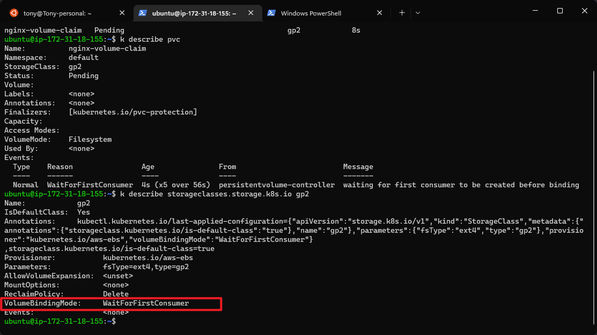

# PERSISTING DATA IN KUBERNETES

The pods created in Kubernetes are ephemeral, they don't run for long. When a pod dies, any data that is not part of the container image will be lost when the container is restarted because Kubernetes is best at managing stateless applications which means it does not manage data persistence. To ensure data persistent, the PersistentVolume resource is implemented to acheive this.

The following outlines the steps:

## STEP 1: Setting Up AWS Elastic Kubernetes Service With EKSCTL

- Downloading and extracting the latest release of eksctl with the following command: 
```
curl --silent --location 
"https://github.com/weaveworks/eksctl/releases/latest/download/eksctl_$(uname -s)_amd64.tar.gz" | tar xz -C /tmp
```

- Moving the extracted binary to /usr/local/bin: 
  
```  
sudo mv /tmp/eksctl /usr/local/bin
```

- Testing the installation was successful with the following command:
``` 
eksctl version
```


- setting up EKS cluster with the command line 

```
eksctl create cluster \
  --name prj23 \
  --version 1.24 \
  --region us-east-1 \
  --nodegroup-name worker-nodes \
  --node-type t2.medium \
  --nodes 2
```


# STEP 2: Creating Persistent Volume Manually For The Nginx Application

```
sudo cat <<EOF | sudo tee ./nginx-pod.yaml
apiVersion: apps/v1
kind: Deployment
metadata:
  name: nginx-deployment
  labels:
    tier: frontend
spec:
  replicas: 3
  selector:
    matchLabels:
      tier: frontend
  template:
    metadata:
      labels:
        tier: frontend
    spec:
      containers:
      - name: nginx
        image: nginx:latest
        ports:
        - containerPort: 80
EOF
```


Exec into the deployment to check what is inside the nginx pod


Describe the pod and node to get a better information about it

`kubectl get pod (name of pod) -o wide`


`kubectl get describe node (the name where the pod is running) -o wide`


- Creating a volume in the Elastic Block Storage section in AWS in the same AZ as the node running the nginx pod which will be used to mount volume into the Nginx pod.


- Updating the deployment configuration with the volume spec and volume mount:

```
apiVersion: apps/v1
kind: Deployment
metadata:
  name: nginx-deployment
  labels:
    tier: frontend
spec:
  replicas: 1
  selector:
    matchLabels:
      tier: frontend
  template:
    metadata:
      labels:
        tier: frontend
    spec:
      containers:
      - name: nginx
        image: nginx:latest
        ports:
        - containerPort: 80
        volumeMounts:
        - name: nginx-volume
          mountPath: /usr/share/nginx/
      volumes:
      - name: nginx-volume
        awsElasticBlockStore:
          volumeID: "vol-07b537651bbe68be0"
          fsType: ext4
```


# STEP 3: Managing Volumes Dynamically With PV and PVCs

- PVs are resources in the cluster. PVCs are requests for those resources and also act as claim checks to the resource.By default in EKS, there is a default storageClass configured as part of EKS installation which allow us to dynamically create a PV which will create a volume that a Pod will use.
  
- Verifying that there is a storageClass in the cluster:$ kubectl get storageclass


- Creating a manifest file for a PVC, and based on the gp2 storageClass a PV will be dynamically created:

```
apiVersion: v1
    kind: PersistentVolumeClaim
    metadata:
      name: nginx-volume-claim
    spec:
      accessModes:
      - ReadWriteOnce
      resources:
        requests:
          storage: 2Gi
      storageClassName: gp2
```

- Checking the setup:

`kubectl get pvc`


Checking for the volume binding section:
```
kubectl describe storageclass gp2
```




The PVC created is in pending state because PV is not created yet. Editing the nginx-pod.yaml file to create the PV:

```
apiVersion: apps/v1
kind: Deployment
metadata:
  name: nginx-deployment
  labels:
    tier: frontend
spec:
  replicas: 1
  selector:
    matchLabels:
      tier: frontend
  template:
    metadata:
      labels:
        tier: frontend
    spec:
      containers:
      - name: nginx
        image: nginx:latest
        ports:
        - containerPort: 80
        volumeMounts:
        - name: nginx-volume-claim
          mountPath: /tmp/tony
      volumes:
      - name: nginx-volume-claim
        persistentVolumeClaim:
          claimName: nginx-volume-claim
```
- The '/tmp/tony' directory will be persisted, and any data written in there will be stored permanetly on the volume, which can be used by another Pod if the current one gets replaced.

